Metrics
================
Last Update: 2021-04-11

We use [plausible.io](plausible.io) for our analytics. This is an Open
Source system that respect users privacy (does not use cookies and is
GDPR compliant).

Our website stats publicly available at plausible.io, you can check them
[here](https://plausible.io/open-neuroscience.com?period=12mo).

Being user-driven means we have to pay close attention at how our
audience interacts with our content. This includes the website, our
[Twitter account](twitter.com/openneurosci) , and our [YouTube
Channel](https://www.youtube.com/channel/UCHPvi_HaEU7OQgXQBh9ECvQ) ,
where we host video content such us our Seminar Series Streaming.

### Website Analytics

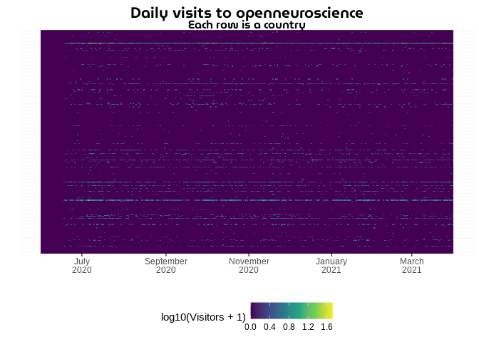<!-- -->

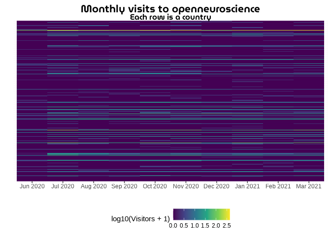<!-- -->

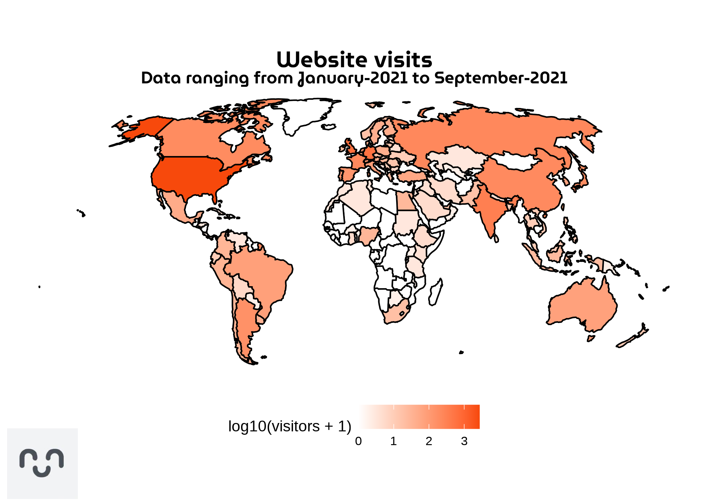<!-- -->

#### Maps

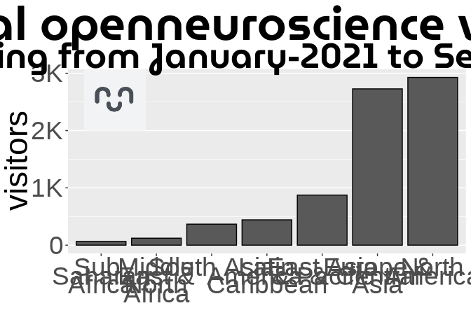<!-- -->

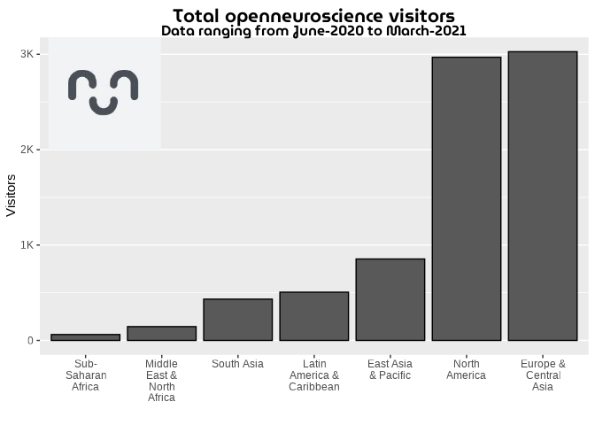<!-- -->

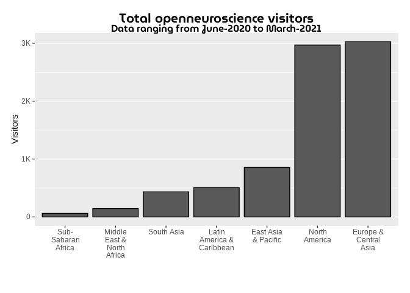<!-- -->

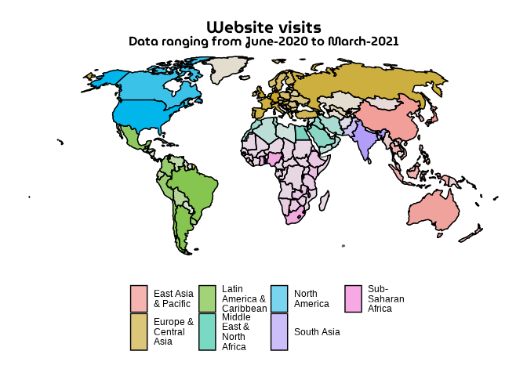<!-- -->

    ## # A tibble: 26 x 3
    ## # Groups:   code [4]
    ##    Date       code  Visitors
    ##    <date>     <chr>    <dbl>
    ##  1 2020-07-07 USA         51
    ##  2 2020-07-22 USA         32
    ##  3 2020-07-24 USA         32
    ##  4 2021-03-24 USA         29
    ##  5 2020-07-08 USA         28
    ##  6 2020-10-01 USA         28
    ##  7 2020-10-05 USA         28
    ##  8 2020-11-12 USA         28
    ##  9 2021-02-22 USA         28
    ## 10 2020-10-06 USA         26
    ## # … with 16 more rows

### Twitter Analytics

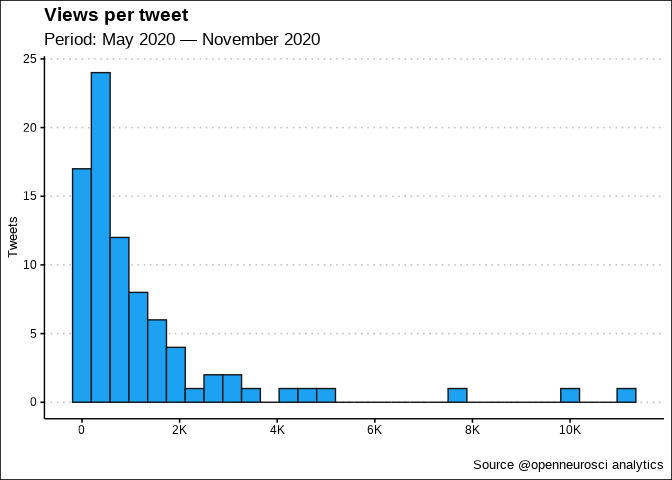<!-- -->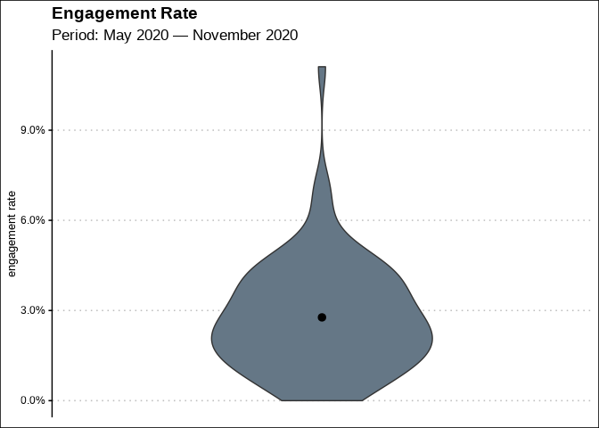<!-- -->

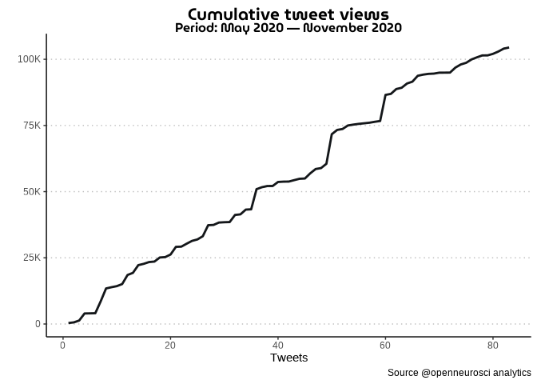<!-- -->

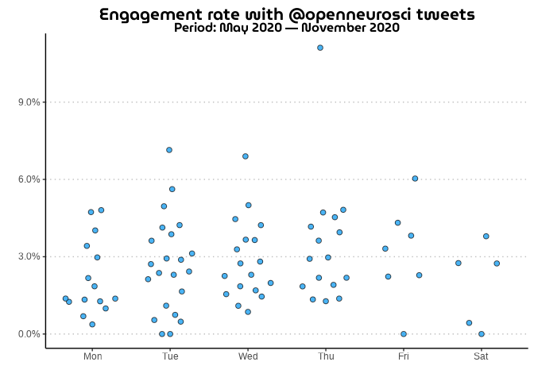<!-- -->

### YouTube Analytics
