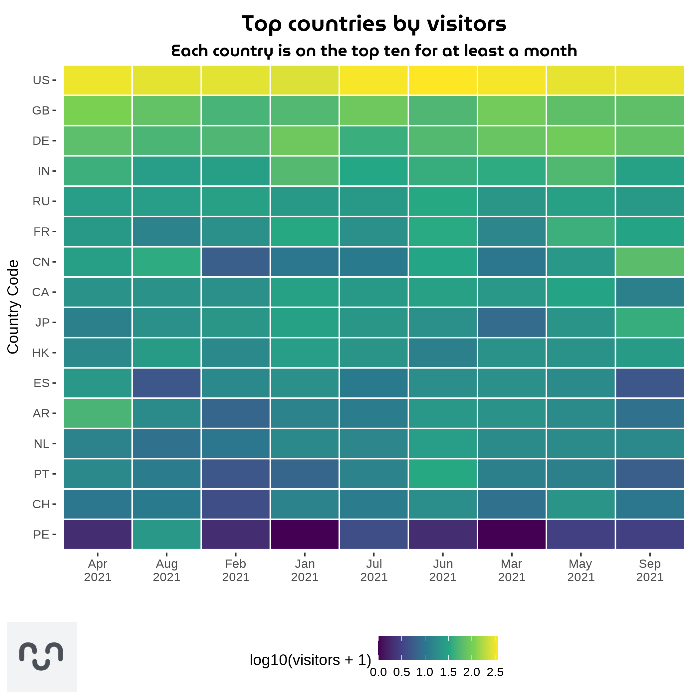
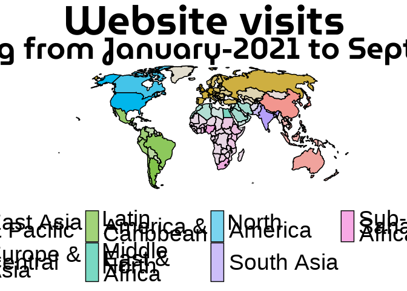
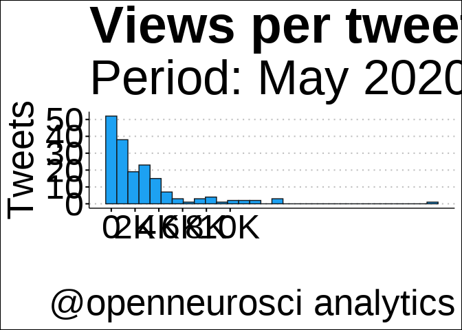
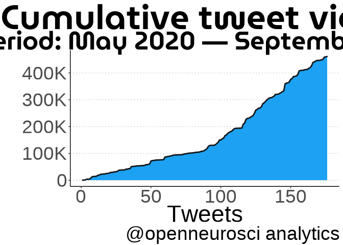

Metrics
================
Last Update: 2021-11-28

We use [plausible.io](plausible.io) for our analytics. This is an Open
Source system that respect users privacy (does not use cookies and is
GDPR compliant).

Our website stats publicly available at plausible.io, you can check them
[here](https://plausible.io/open-neuroscience.com?period=12mo).

Being user-driven means we have to pay close attention at how our
audience interacts with our content. This includes the website, our
[Twitter account](twitter.com/openneurosci) , and our [YouTube
Channel](https://www.youtube.com/channel/UCHPvi_HaEU7OQgXQBh9ECvQ) ,
where we host video content such us our Seminar Series Streaming.

### Website Analytics

<!-- -->

#### Maps

<!-- -->

<!-- -->

<!-- -->

### Twitter Analytics

<!-- -->

<!-- -->

### YouTube Analytics

TBA
